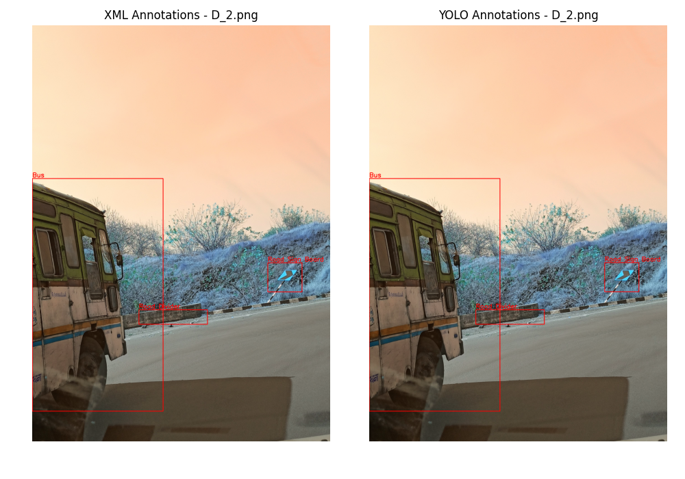
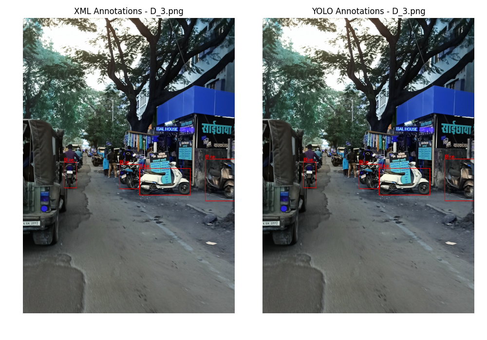
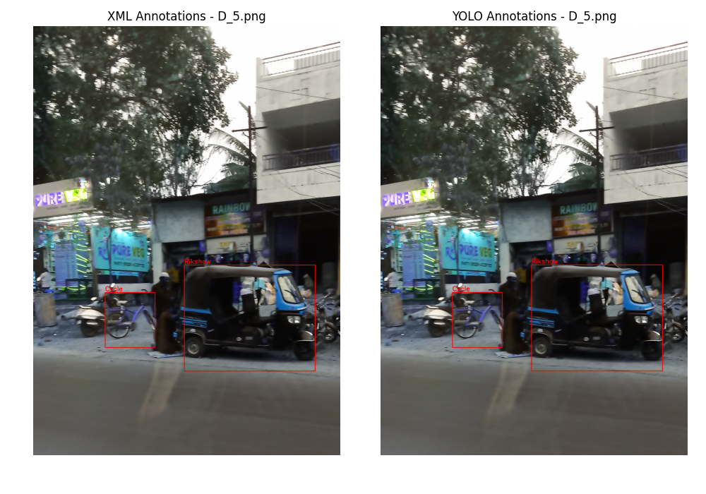

# Convert Pascal VOC XML files to YOLO TXT format

This tool converts object detection annotations from **Pascal VOC XML format** to **YOLO TXT format**. It is ideal for preparing datasets for YOLO-based models like YOLOv5, YOLOv8, and the other versions.

## Features

- Parses Pascal VOC-style `.xml` files
- Outputs YOLO-formatted `.txt` files (one per image)
- Supports multiple object classes
- Option to visualize annotations (VOC and YOLO)
- Converts bounding boxes to normalized format

## Installation
```bash
pip install -r requirements.txt
```

## Usage
```bash
python xmltotxt.py -xml "./xml" -out "./out" -c "labels.txt" -create "N"
```

### Mandatory arguments

```bash
-xml 
```

### Optional arguments

```bash
-c, -out, -create
```

## Example

> Input XML file

```xml
<annotation>
	<filename>D_2.png</filename>
	<size>
		<width>2134</width>
		<height>2988</height>
	</size>
	<object>
		<name>Bus</name>
		<bndbox>
			<xmin>1</xmin>
			<ymin>1103</ymin>
			<xmax>937</xmax>
			<ymax>2771</ymax>
		</bndbox>
	</object>
	<object>
		<name>Road Divider</name>
		<bndbox>
			<xmin>764</xmin>
			<ymin>2044</ymin>
			<xmax>1255</xmax>
			<ymax>2148</ymax>
		</bndbox>
	</object>
	<object>
		<name>Road Sign Board</name>
		<bndbox>
			<xmin>1687</xmin>
			<ymin>1707</ymin>
			<xmax>1932</xmax>
			<ymax>1916</ymax>
		</bndbox>
	</object>
</annotation>
```

> Output labels file
```text
Bike
Bus
Cycle
Rikshaw
Road Divider
Road Sign Board
```

The line number (starting from index 0) becomes the class ID in YOLO format.

> Output text file
```text
1 0.219775 0.648260 0.438613 0.558233
4 0.473055 0.701473 0.230084 0.034806
5 0.847938 0.606258 0.114808 0.069946
```

Each line in a YOLO label `.txt` file:

```text
<class_id> <x_center> <y_center> <width> <height>
```

- All values are normalized (0–1).
- Coordinates are relative to the image size.
- All values are separated by a whitespace.

## Visual Confirmation





## Usage tips

1. Pass the `-create` argument if you want a new labels file to be generated from the labels present in all the XML files.
2. If you want to create a new labels file, avoid passing the `-c` argument as it will be skipped due to the higher preference of the new file.
3. If you have an existing labels file you want to use, avoid passing the `-create` argument due to the higher priority for using the newly created labels file.
4. If the directory passed to the `-out` argument doesn't exist, you will be prompted for confirmation to create the path and proceed with the conversion or to exit the program and specify the correct output directory.